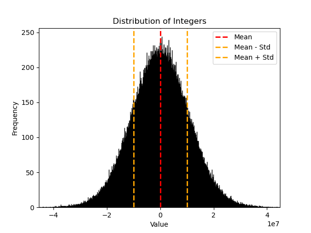
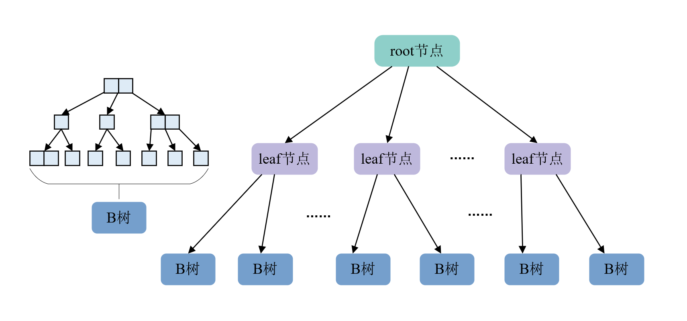
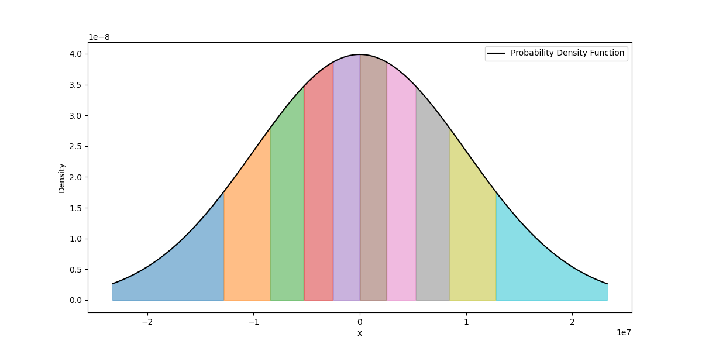
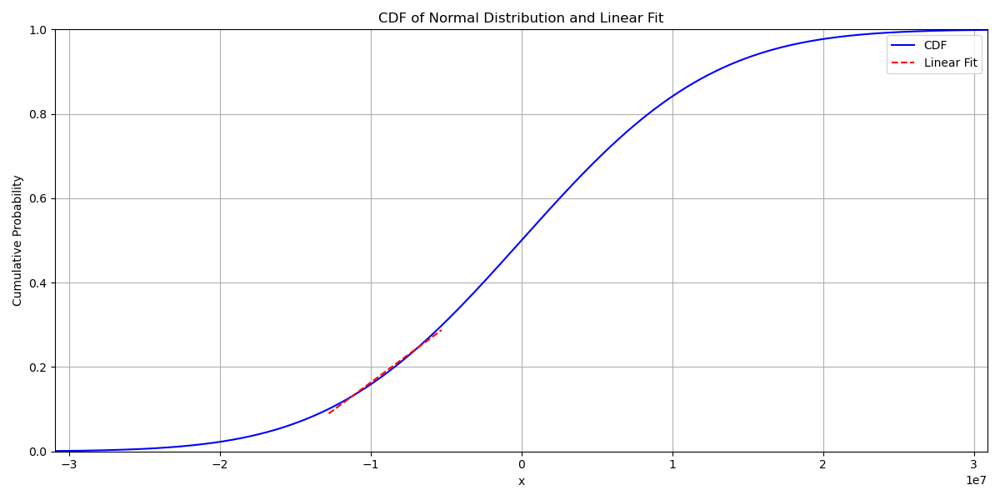
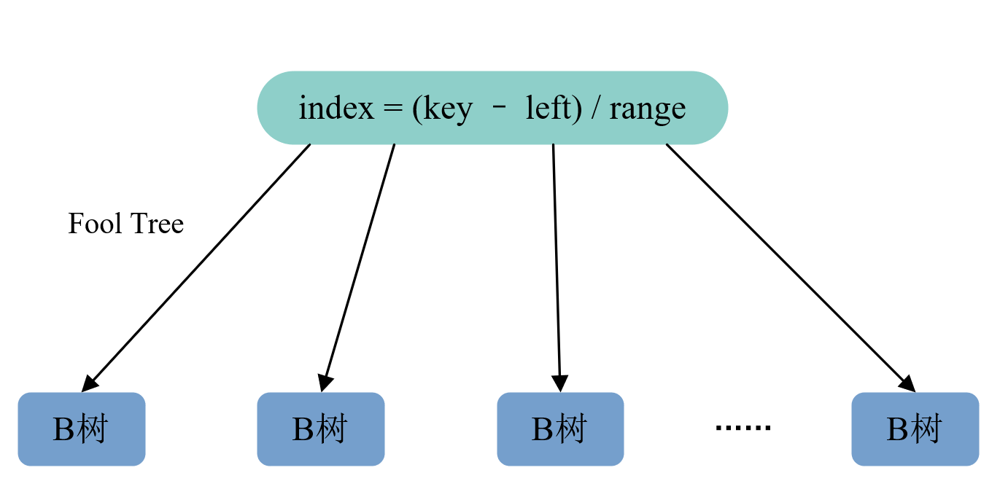
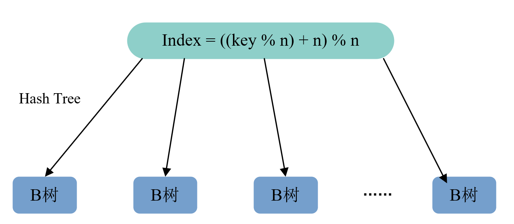
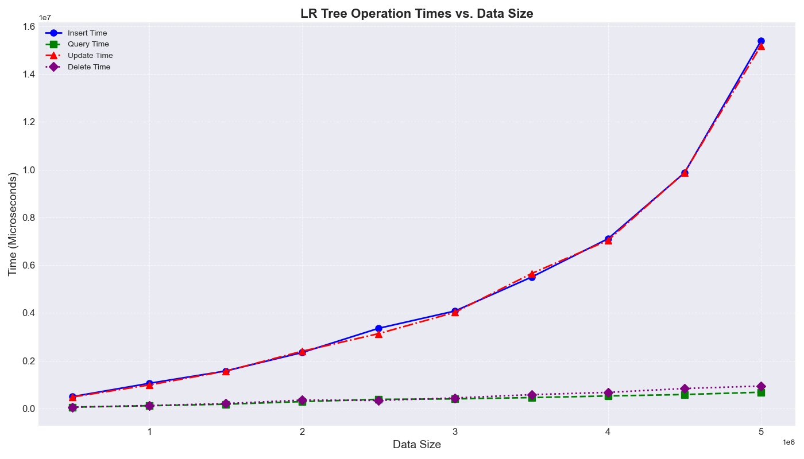
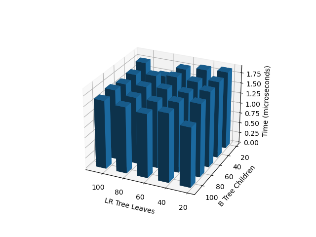
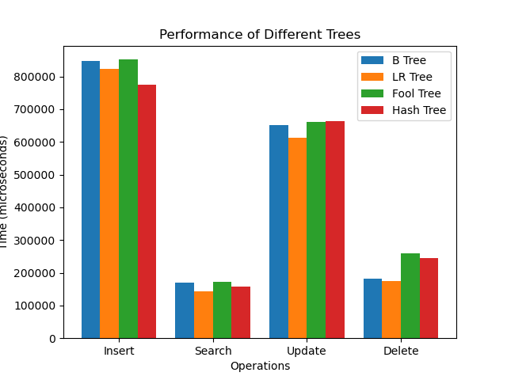

## 线性回归查找树构建与性能验证
### 0x01 key-value对定义与概率分布

我们这里定义了一个结构体`KV_Node`用于表示索引结构所维护的键值对信息，其中key值是一个`[INT_MIN + 1, INT_MAX - 1]`范围的`int`类型整数，而value值是一段字符串，其源码如下所示：

```c
// inc/utility.h
typedef struct KV_Node {
    int key;
    char *str;
} KV_Node;
```
key值遵循正态分布，其均值和标准差在`inc/utility.h`的宏定义中给出：
```c
// inc/utility.h
#define RAND_MEAN 0              // 随机数均值
#define RAND_SIGMA 10000000.0    // 随机数标准差
```
这些随机key值，是通过`Box-Muller`方法生成的，并可以可视化地展现在下图中，下图展示了上述参数设置下某一次仿真实验中产生的1000000个随机key值的分布情况，可以看到，key值基本分布在`[-4e7, 4e7]`范围之内并满足$3\sigma$准则
<div align=center></div>
<center>Fig1 程序所使用的key值的概率分布, 参数取值mean = 0, sigma = 1e7</center>

### 0x02 线性回归树 LR Tree
#### 统计信息的获取
在产生了若干的key值之后，需要再次统计出这些key值的均值和标准差(key值服从正态分布是作为先验信息给到程序的，但是为了体现“自学习”的主题这里还是再次用程序判断了这些数据的均值和标准差)：
```c
// src/utility.c
void statistic_feature(int *arr, int n, double *avg, double *sigma) {
    double sum = 0.0;        // 总和
    double square_sum = 0.0; // 平方和

    for (int i = 0; i < n; i++) {
        sum += arr[i];
        square_sum += pow(arr[i], 2);
    }
    *avg = sum / n;
    *sigma = sqrt((square_sum - n * pow(*avg, 2)) / (n - 1));
}
```
在获得了`mean`和`sigma`这两个统计参数之后，就可以基于正态分布的特征求出累积分布函数:
$$\Phi(x) = \frac{1}{2}[1+erf(\frac{x}{\sqrt{2}})]$$
```c
// src/utility.c
double normal_cdf(double mean, double sigma, double x) {
    return 0.5 * (1.0 + erf((x - mean) / (sigma * sqrt(2))));
}
```
不过这里是使用其反函数，基于二分思想找到指定累积分布函数值下的自变量(也就是key)的取值：
```c
// src/utility.c
double normal_icdf(double mean, double sigma, double y) {
    assert(y >= 0.0 && y <= 1.0);
    // 开始二分查找
    double left = mean - 10.0 * sigma;  // 设置搜索的左边界
    double right = mean + 10.0 * sigma; // 设置搜索的右边界
    while (right - left > EPSILON) {
        double mid = (left + right) / 2.0;
        double cdf_val = normal_cdf(mean, sigma, mid);
        if (cdf_val > y) {
            right = mid;
        } else {
            left = mid;
        }
    }
    return (right + left) / 2.0;
}
```
#### 线性回归树的整体结构
这里构建的线性回归树一共分为三层，第一层是一个根节点`root`，由`root`向下是若干叶子节点`leaf`，每个`leaf`下面又是若干个B树子节点(之所以采用B树作为子节点，一方面是方便在之后的性能比较中与纯粹的B树在基准上进行对齐，另一方面其他常见的结构，如双链表、哈希表等大多不能实现$log(N)$级别的增删改查操作)

<div align=center></div>
<center>Fig2 一个三层的线性回归树的结构</center>

#### 线性回归树的构造
前文已经说过，可以通过一些key值样本估算出key值分布的均值和标准差，对于这样一个正态分布的模型，在`root`节点处我们按照CDF的取值将其均分为指定分数，比如说如果我们想构造一个具有`n`个`leaf`节点的`root`节点，则要求出在该正态分布的前提下，key值的取值应该分别为多少才能有：
$$\Phi(key)=\frac{1}{n},\frac{2}{n},...,1$$
这是由`double normal_icdf(double mean, double sigma, double y)`函数计算出来的，在算出这`n`个值之后，我们实质上就是以概率相等的原则将整个正态分布的概率密度函数划分为了`n`个面积相等的区间，如图Fig3所示：

<div align=center></div>
<center>Fig3 root节点对整个key分布的区间的划分，这里是划分了10个等概率区间出来</center>

对于`root`节点来说，其需要做的就是根据统计出的`mean`和`sigma`值以及设定的`leaf`节点的数量划分出`n`个等概率key值区间，每一个`leaf`节点管理其中一个`key`值区间，在构造好后`root`节点之后依次构造出`n`个`leaf`节点，其逻辑如下所示：
```c
// src/lr_tree.c
LR_Tree_Leaf *lr_tree_leaf_create(double mean, double sigma, int b_tree_num,
                                  int left, int right) {
    LR_Tree_Leaf *leaf = (LR_Tree_Leaf *)malloc(sizeof(LR_Tree_Leaf));
    leaf->left = left, leaf->right = right;
    leaf->b_tree_num = b_tree_num;
    // 基于最小二乘给出拟合[left, right]段的直线参数
    linear_fitting(mean, sigma, left, right, &leaf->k, &leaf->b, b_tree_num);
    // 此时使用y = k * x + b拟合正态分布函数CDF的x = [left, right]段
    // 而y值落在[0, b_tree_num - 1]之上
    leaf->b_tree_node = (struct B_Tree**)malloc(b_tree_num * sizeof(struct B_Tree*));
    for(int i = 0; i < b_tree_num; i ++){
        // 为该叶子节点赋予b_tree_num个B树子节点
        leaf->b_tree_node[i] = b_tree_create();
    }
    return leaf;
}
```
这里的`void linear_fitting(double mean, double sigma, int left, int right, double *k, double *b, int base)`实质上是使用最小二乘法拟合了从正态分布CDF的`[left, right]`段随机取的500个点，再将最小二乘的结果归一化到`[0, b_tree_num]`区间中去，以实现对每一个key值都能在`leaf`节点内以$O(1)$的时间之内找到分治该key值的那一颗B树，一方面加快了查询时间，另一方面使得每一个B树所分治的key值的数量尽可能均匀，其过程可以如fig4所示：

<div align=center></div>
<center>Fig4 正态分布的CDF及对其中一段的线性拟合，代码中将这拟合一段的纵坐标值重映射到[0, b_tree_num]上去</center>

#### 线性回归树的B树节点查找
之所以只在一个递增的CDF数组中进行二分而不是将线性回归树划分出更多层并逐层进行二分，是因为这两种方式期望的二分次数相等且后者会占用更多的内存来维护线性回归树的节点结构：
$$log(n) = log(\frac{n}{m}) + log(m)$$
因此当给定一个key值之后，找到这个key值理论上应该被“分配”的B树也是很简单的：
```c
// src/lr_tree.c
struct B_Tree *find_b_tree(const LR_Tree_Root *root, int key){
    // 基于二分选中对应的叶子节点分支
    int*arr = root->right_endpoint;
    int n = root->leaf_num;// 叶子的数量
    int l = 0, r = n - 1;
    // 通过二分找到第一个存储大于等于key值的right_endpoint数组值的索引
    while(l < r){
        int mid = (l + r) >> 1;
        if(arr[mid] >= key){
            r = mid;
        }else{
            l = mid + 1;
        }
    }
    LR_Tree_Leaf* leaf = root->leaf_node[l];// 取出二分到的叶子节点指针
    // 根据拟合公式计算出是哪一个B树
    int b_tree_index = (int)(leaf->k * key + leaf->b);
    if(b_tree_index >= leaf->b_tree_num) b_tree_index = leaf->b_tree_num - 1;
    else if(b_tree_index < 0) b_tree_index = 0;
    return leaf->b_tree_node[b_tree_index];
}
```
这里首先是在`root`节点中根据二分判断根据这个key的值，其应当属于哪一个叶子节点，再在叶子节点中根据斜率和截距参数判断其会被映射到哪一个B树中去，最后将对应的那一个B树的指针返回即可。

#### 线性回归树的增删改查
在针对一个key值基于上述法则唯一确定好其分属于哪一个B树之后，则线性回归树的增删改查就可以完全建立在B树之上，也就是间接调用B树的增删改查接口：
```c
// src/lr_tree.c
bool lr_tree_exist(const LR_Tree_Root *lr_tree, int key){
    return b_tree_exist(find_b_tree(lr_tree, key), key);
}

void lr_tree_erase(const LR_Tree_Root *lr_tree, int key){
    b_tree_erase(find_b_tree(lr_tree, key), key);
}

void lr_tree_insert(const LR_Tree_Root *lr_tree, int key, const char *s){
    b_tree_insert(find_b_tree(lr_tree, key), key, s);
}

KV_Node *lr_tree_query(const LR_Tree_Root *lr_tree, int key){
    return b_tree_query(find_b_tree(lr_tree, key), key);
}
```

### 0x03 只是在增加B树数量? Fool Tree和Hash Tree
从以上的线性回归树结构来讲，最显著的特征就是其所包含的B树的数量大大增加了，相较于单一的B树，其势必会增大维护B树结构所需的内存开销，而找到key值所属的B树的过程又有点类似于二叉树查找或者哈希，为了探究单纯增大B树数量和线性回归树在性能方面的差异，这里我又简单构造了两种直接由key值映射到B树节点的结构：Fool Tree和Hash Tree
#### Fool Tree的结构
如果不再设立`leaf`节点，而是直接约定`root`节点连接了指定数量的B树，且对于一个随机的、服从正态分布的key值，找到其所属B树的方式是通过：
$$index = (key - left) / range$$
其中left就是key值分布的左边界，在程序中即为`INT_MIN + 1`，,range为每一颗B树管理的key值的范围，这样可以获得一个在`[0, b_tree_num - 1]`之间的整数值，以该值为索引取出对应的B树即可，其结构可以被简单地表示为下图：

<div align=center></div>
<center>Fig5 Fool Tree的结构</center>

#### Hash Tree的结构
考虑到上述的Fool Tree有明显的数据不均衡问题（靠近均值的区间对应的B树所进行的增删改查操作明显比靠近边缘的要多），这样我们其实可以稍微改动一下求index的方法，从除法换成取模：
$$index = ((key \% n) + n)\%n$$
这样在range很大的情况之下，可以近似认为每颗B树进行增删改查的期望次数是相等的。
Hash Tree的结构如下图所示：

<div align=center></div>
<center>Fig6 Hash Tree的结构</center>

### 0x04 性能分析对比
#### 不同操作次数下线性回归树增删改查的时间开销对比
在`root`节点有10个根节点，每个根节点拥有10颗B树子节点的情况下，对线性回归树的增删改查时间进行测试，测试次数从500000开始直到5000000，步长为500000，记录下时间并用折线图表示出来，如下所示：

<div align=center></div>
<center>Fig7 线性回归树的增删改查时间随着操作次数增大的变化趋势</center>

可以看到随着操作次数的增加，所需时间基本呈类似指数级别的上升，这是因为单次操作所需的时间是$log(n)$级别的，随着树的深度的加大，其单次操作的时间也在逐渐上升，最终导致了类似于$nlog(n)$的图像。


#### 线性回归树在不同初始化参数下增删改查时间开销对比

这里设定分别进行1000000次增删改查操作，改变线性回归树的叶子节点数量和每个叶子节点下的B树的数量，统计完成指定操作次数所需的时间，如下所示：

<div align=center></div>
<center>Fig8 线性回归树在不同参数下的的增删改查时间</center>

基本上多次运行的结果都显示增删改查时间会随着参数不同出现一定的浮动，不过目前还没有理论分析其性能差异产生的原因。

```
平均值: -3583.593194  标准差: 10028984.021527
插入次数: 1000000, 更改次数: 1000000, 删除次数: 1000000, 查询次数: 1000000
B树插入 1000000 次所需时间: 667000.000000 (微秒)
LR树插入 1000000 次所需时间: 630000.000000 (微秒)
FOOL树插入 1000000 次所需时间: 662000.000000 (微秒)
HASH树插入 1000000 次所需时间: 655000.000000 (微秒)
```


#### 典型参数下进行指定次数操作不同树型结构所需时间对比

这里指定线性回归树的参数为100 * 100，而Fool Tree和Hash Tree的B树数量为10000，与线性回归树保持一致，测试这三种树和B树在分别增删改查1000000次下所需的时间：

<div align=center></div>
<center>Fig9 四种树的的增删改查时间</center>

可以较为明显的看到LR树在查询、更改、删除三种操作中都有最短的时间，而插入操作的速度仅次于Hash Tree，同时也说明其性能的提高并不是仅仅依靠B树数量的增加，线性回归模型确实可以一定程度上提高索引查询的效率。

### 0x05 
#### 情景假定
结合问题的背景，让AI给出尽可能精确、简短、符合预期的回答
<div align=center></div>
<center>Fig10 对ChatGPT假定场景</center>

#### 关键字标出
对于想要重点突出的部分，使用****符号标出
<div align=center></div>
<center>Fig11 使用符号标记重点</center>


etc...
